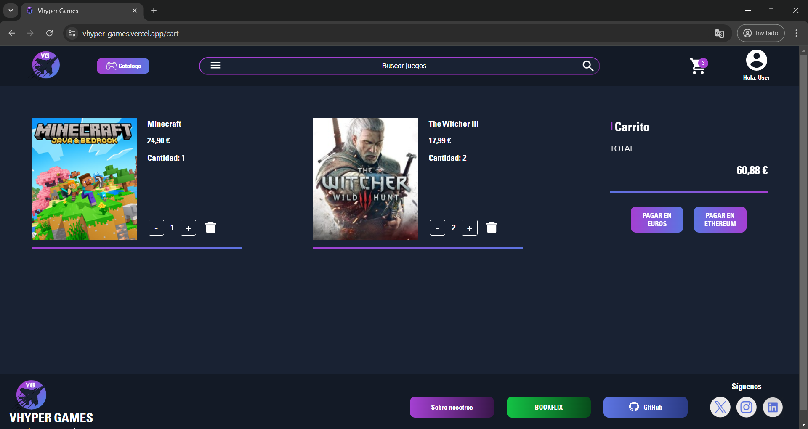
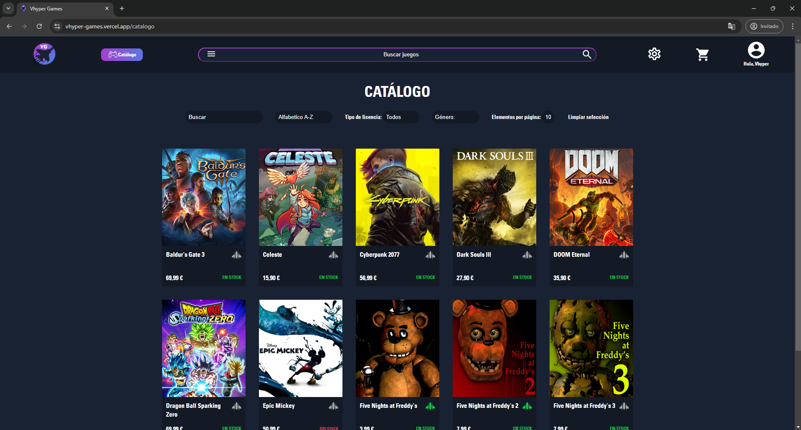

# VhyperGames

VhyperGames es un proyecto que trata sobre la creación de un E-Commerce basado en una tienda de videojuegos. Cuenta con todo el ciclo de vida de un proyecto, desde su diseño en Figma hasta su despliegue.

El proyecto incluye múltiples funcionalidades clave para garantizar una experiencia completa y eficiente:

- **Modos de pago diversos:** Integra pagos tanto en euros como en Ethereum, permitiendo una mayor flexibilidad para los usuarios.

- **Vista de administrador avanzada:** Ofrece un panel de control completo para la gestión de productos y usuarios.

- **Inteligencia Artificial para análisis de reseñas:** Implementa un sistema de IA capaz de evaluar y clasificar las reseñas de los usuarios, proporcionando valoraciones útiles sobre los juegos y mejorando la experiencia del cliente.

Este conjunto de herramientas asegura una plataforma robusta y dinámica, adaptada a las necesidades actuales del mercado.


## Indice

- [Enlace a la Página](#Enlace-a-la-Página)
- [Visualización](#Visualización)
- [Tecnologías](#tecnologías)
- [Herramientas de Desarrollo](#herramientas-de-desarrollo)
- [Herramientas de Diseño](#herramientas-de-diseño)
- [Diseño de Figma](#diseño-de-figma)
- [Pago en Euros](#pago-en-euros)
- [Pago en Ethereum](#pago-en-ethereum)
- [Ramas Git](#ramas-git)
- [Créditos](#créditos)

<br>

## Enlace a la Página

[Acceder a la página aquí](https://vhyper-games.vercel.app/)

<br>

## Visualización

<br>


<br>



<br>



<br>

## Tecnologías

<br>

<p align="left">
  <!-- Frontend -->
  <a href="https://reactjs.org/" target="_blank" rel="noreferrer">
    
  </a>
  <a href="https://developer.mozilla.org/en-US/docs/Web/JavaScript" target="_blank" rel="noreferrer">
    
  </a>
  <a href="https://www.w3.org/html/" target="_blank" rel="noreferrer">
    
  </a>
  <a href="https://www.w3schools.com/css/" target="_blank" rel="noreferrer">
    
  </a>

  <!-- Backend -->
  <a href="https://nodejs.org" target="_blank" rel="noreferrer">
    
  </a>
  <a href="https://www.w3schools.com/cs/" target="_blank" rel="noreferrer">
    
  </a>
  <a href="https://www.mysql.com/" target="_blank" rel="noreferrer">
    
  </a>
  <a href="https://www.sqlite.org/" target="_blank" rel="noreferrer">
    
  </a>
</p>

<br>

## Herramientas de Desarrollo

<p align="left">
  <!-- Visual Studio Code -->
  <a href="https://code.visualstudio.com/" target="_blank" rel="noreferrer">
    
  </a>
  <!-- Visual Studio 2022 -->
  <a href="https://visualstudio.microsoft.com/es/" target="_blank" rel="noreferrer">
    
  </a>
</p>

## Herramientas de Diseño

<p align="left">
  <!-- Figma -->
  <a href="https://www.figma.com/" target="_blank" rel="noreferrer">
    
  </a>
</p>

<br>

## Diseño de Figma

<br>

Este es el enlace para visualizar el proyecto en Figma:
[Figma](https://www.figma.com/design/wWY8lH2i4cPX99T8uwv4Pb/PROYECTO-VHYPERGAMES---FIGMA?node-id=4-2&t=lIhVvHxcXVkRS3as-1)

En la carpeta "doc" del proyecto se encuentra el diseño en formato PDF.


<br>

## Pago en Euros 

<br>

Para el método de pago por tarjeta utilizamos Stripe, una plataforma tecnológica que proporciona una infraestructura económica para procesar pagos en línea. Ofrece herramientas y APIs para integrar pagos en aplicaciones y sitios web, permitiendo a las empresas aceptar tarjetas de crédito, débito y otros métodos de pago.

Actualmente, está en modo de prueba, por lo que para realizar pagos se deben usar las tarjetas de prueba que proporciona Stripe en su documentación.

- [Tarjetas para pagos exitosos](https://docs.stripe.com/testing?locale=es-ES&testing-method=card-numbers#cards)

- [Tarjetas para pagos rechazados](https://docs.stripe.com/testing?locale=es-ES&testing-method=card-numbers#pagos-rechazados)

<br>

## Pago en Ethereum 


Para realizar los pagos con Ethereum utilizamos la extensión de MetaMask y la red de prueba de[Ephemery](https://ephemery.dev/).

<br>

## Ramas Git

```
  main
  |__ develop
      |__ testing
      |__ alejandro
      |__ jmolme
      |__ raquel
      |__ fernando
      |__ pablo

```

## Créditos

<br>

Este proyecto fue creado por el grupo formado por:
- [Alejandro Barrionuevo Rosado](https://github.com/Alejandro-BR)
- [José Molina Meléndez](https://github.com/Jmolmel)
- [Raquel López Bermúdez](https://github.com/Rlopber)
- [Pablo Ruiz Domínguez](https://github.com/pablo-r-d)
- [Fernando Jafet Sánchez Lagos](https://github.com/Fernandosanchez1609)

<br>

Para la realización del proyecto intermodular del segundo año del ciclo formativo de grado superior en Desarrollo de Aplicaciones Web, en el centro C.P.I.F.P. Alan Turing.

Curso 2024/2025
